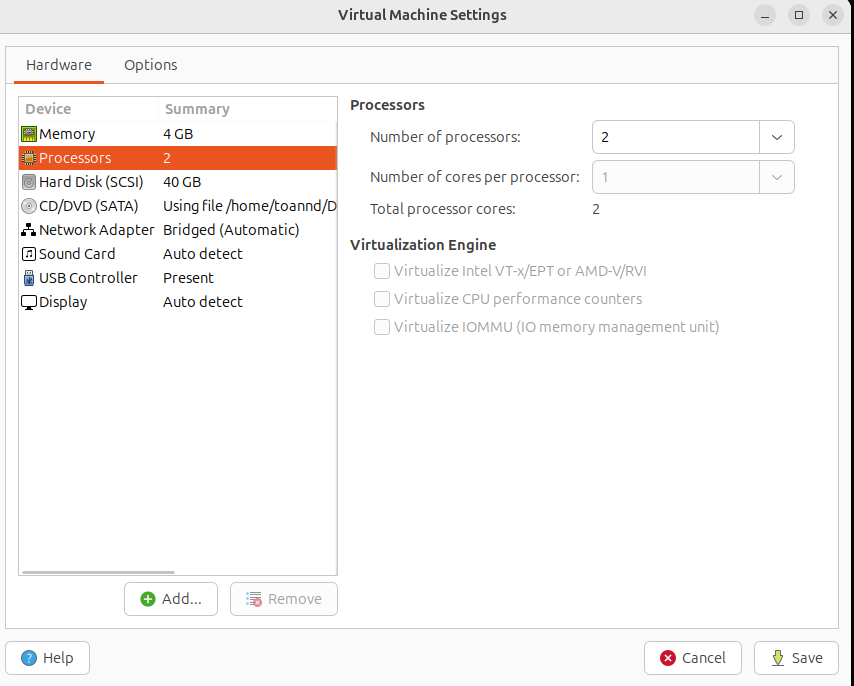
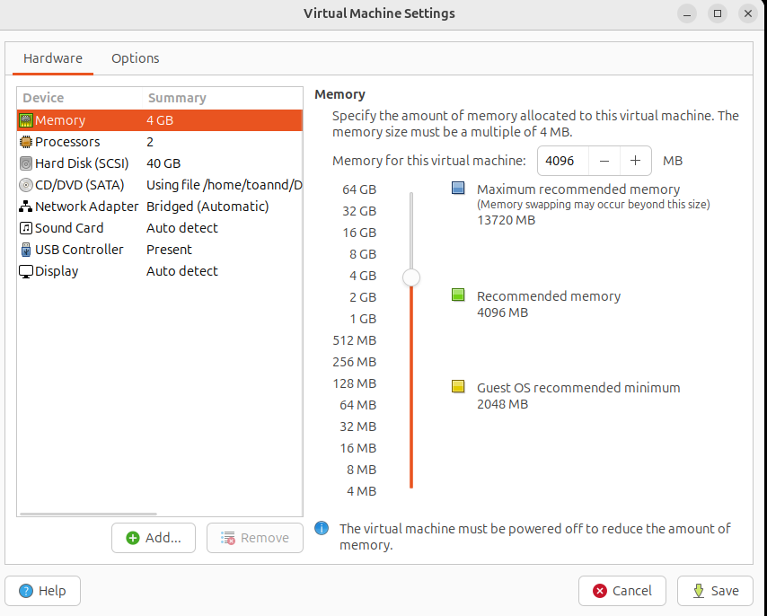
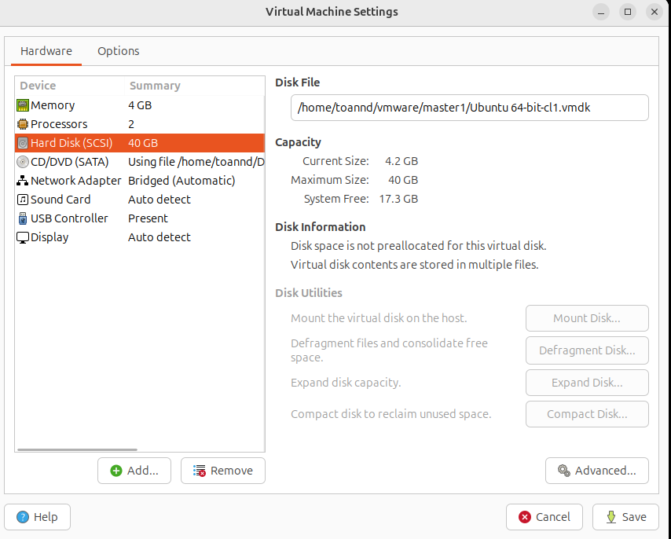
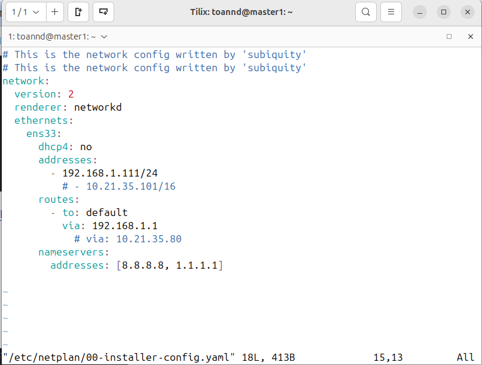
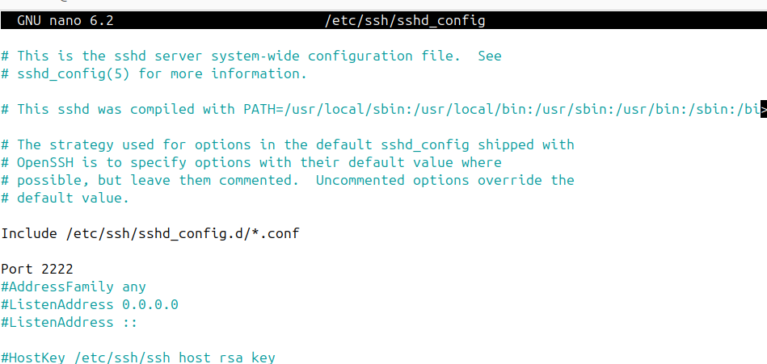
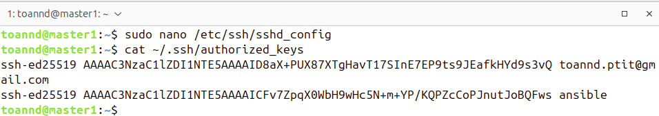
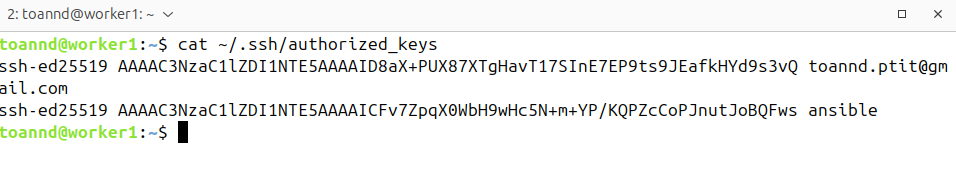
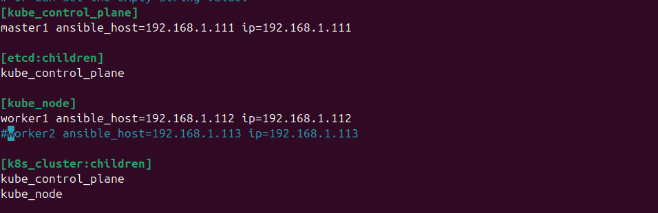
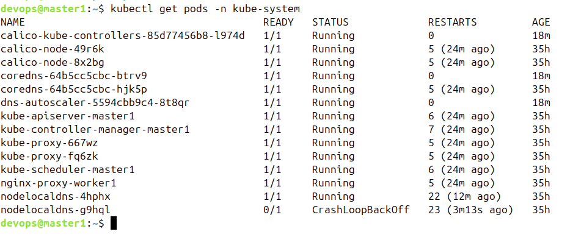

#  Triển khai Kubernetes (1 điểm)

##  Yêu cầu:

### Y/c 1:

- Triển khai được Kubernetes thông qua công cụ **Minikube trên 1 node**: **0.5 điểm**  
  **Hoặc**
- Triển khai được Kubernetes thông qua công cụ **kubeadm** hoặc **kubespray** lên:
  - **1 master node VM**
  - **1 worker node VM**  
  👉 **1 điểm**

---

##  Output:

- **Tài liệu cài đặt**:
  - Đã sử dụng công cụ gì?
  - Các file config liên quan

- **Ảnh chụp log** của các lệnh kiểm tra hệ thống như:
  - `kubectl get nodes -o wide`
  - `kubectl get pods -A -o wide`

---

##  Tài liệu triển khai

###  Chuẩn bị

**Hai máy ảo** với cấu hình như sau:

- **CPU**: 2 core  
- **RAM**: 4GB  
- **Dung lượng bộ nhớ**: 40GB  

 Hình ảnh minh họa:

  
*Thông tin CPU*

  
*Thông tin RAM*

  
*Thông tin ổ đĩa*

###  Tài liệu cài đặt kubespray
**Tài liệu hướng dẫn cài đặt kubespray**: https://github.com/toannd135/Kubenestes-Lab/blob/master/lab1/lab1.md
###  Cấu hình mạng và SSH

Để thuận tiện cho quá trình thực hiện bài tập cuối khóa, em đã thực hiện các cấu hình sau:

###  Địa chỉ IP tĩnh cho hai máy ảo:

- **Master1**: `192.168.1.111`  
- **Worker1**: `192.168.1.112`

####  Đối với Master1:



####  Đối với Worker1:


---

###  Thay đổi cổng SSH

Thực hiện thay đổi **port SSH** trên **cả hai máy ảo** từ mặc định `22` sang `2222`.

#### Sửa file cấu hình SSH

Chạy lệnh sau trên cả hai máy:
```bash
sudo nano /etc/ssh/sshd_config 
```

### Thêm SSH key vào cả hai máy ảo

Thực hiện cấu hình SSH key để tiện kết nối và triển khai tự động (không cần nhập mật khẩu).

Minh họa:

  
*Thêm SSH key vào máy Master1*

  
*Thêm SSH key vào máy Worker1*

---

###  Tạo file cấu hình `inventory.ini`

Thực hiện khai báo địa chỉ IP và port của hai máy ảo để sử dụng cho việc cài đặt  **kubespray**.

 Minh họa:

  
*Nội dung file `inventory.ini` khai báo IP và cổng SSH của các node*

###  Thực hiện cài đặt Kubernetes bằng Kubespray với Ansible

Chạy lệnh sau để tiến hành cài đặt Kubernetes:

```bash
ansible-playbook -i inventory/mycluster/inventory.ini cluster.yml --become --ask-pass --ask-become-pass
```
##  Kiểm tra hệ thống Kubernetes

###  Trạng thái các Pods trong namespace kube-system

```bash
kubectl get pods -n kube-system
```



---

###  Thông tin chi tiết các Nodes

```bash
kubectl get nodes -o wide
```


---

# Kết luận

Kubernetes cluster đã được triển khai thành công sử dụng công cụ Kubespray với kiến trúc multi-node bao gồm 1 master node và 1 worker node. Cả hai máy ảo được cấu hình với thông số phù hợp (2 CPU cores, 4GB RAM, 40GB storage) và địa chỉ IP tĩnh.

Kết quả:
- **Kubespray deployment** hoàn thành thành công với Ansible automation
- **Network configuration** với IP tĩnh và SSH port tùy chỉnh (2222)  
- **SSH key authentication** được thiết lập để tự động hóa quá trình triển khai
- **Cluster status** hiển thị tất cả nodes ở trạng thái Ready