## K8S Helm Chart (1.5đ)

### Yêu cầu 1

#### Nhiệm vụ:
- Cài đặt ArgoCD lên Kubernetes Cluster, expose được ArgoCD qua NodePort
- Cài đặt Jenkins lên Kubernetes Cluster, expose được Jenkins qua NodePort

#### Output 1:

### Cài đặt ArgoCD lên Kubernetes Cluster

Thực hiện cài đặt theo tài liệu: https://argo-cd.readthedocs.io/en/stable/getting_started/

#### Install ArgoCD

```bash
kubectl create namespace argocd
kubectl apply -n argocd -f https://raw.githubusercontent.com/argoproj/argo-cd/stable/manifests/install.yaml
```

**File Manifest cài đặt ArgoCD:** [File Manifest cài đặt Argocd](./manifest/install-argocd.yaml)

#### Expose ArgoCD qua NodePort

File Manifest triển khai dịch vụ ArgoCD qua NodePort (nodePort: 30000):

```yaml
apiVersion: v1
kind: Service
metadata:
  name: argocd-server-nodeport
  namespace: argocd
spec:
  type: NodePort
  ports:
    - port: 80
      targetPort: 8080
      nodePort: 30000
  selector:
    app.kubernetes.io/name: argocd-server
```

#### Truy cập ArgoCD

Truy cập ArgoCD qua đường dẫn: **https://192.168.1.111:30000/**

#### Giao diện ArgoCD

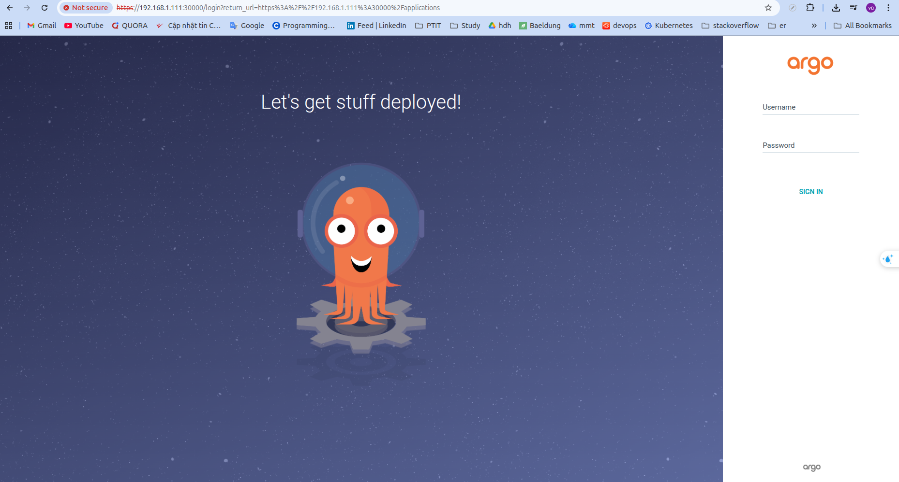

---

### Cài đặt Jenkins lên Kubernetes Cluster

#### Install Jenkins

```bash
kubectl create namespace jenkins
kubectl apply -f jenkins.yaml
```

**File Manifest cài đặt Jenkins:** [Lab6](https://github.com/toannd135/Kubenestes-Lab/tree/master/lab6/jenkins)

#### Truy cập Jenkins

Truy cập Jenkins qua đường dẫn: **http://192.168.1.111:32000/**


#### Giao diện Jenkins


---

### Yêu cầu 2

#### Nhiệm vụ:
- Viết hoặc tìm mẫu Helm Chart cho app bất kỳ, để vào 1 folder riêng trong repo app
- Tạo Repo Config cho app trên, trong repo này chứa các file values.yaml với nội dung của các file values.yaml là các config cần thiết để chạy ứng dụng trên k8s bằng Helm Chart

#### Output 2:
- **Các Helm Chart** sử dụng để triển khai app lên K8S Cluster
- **Các file values.yaml** trong config repo của app  
- **Manifest của ArgoCD Application**
- **Ảnh chụp giao diện** màn hình hệ thống ArgoCD trên trình duyệt
- **Ảnh chụp giao diện** màn hình trình duyệt khi truy cập vào Web URL, API URL
### Kiến trúc Repository

#### Tổng quan

Dự án được tổ chức thành 4 repository chính, phân chia rõ ràng giữa source code và configuration:

---

####  Repository Structure
| Repository | Mô tả | Link |
|------------|-------|------|
| **typ-backend** | Source code backend | [🔗 GitHub](https://github.com/toannd135/typ-backend) |
| **typ-backend-config** | Configuration backend | [🔗 GitHub](https://github.com/toannd135/typ-backend-config) |
| **typ-frontend** | Source code frontend | [🔗 GitHub](https://github.com/toannd135/typ-frontend) |
| **typ-frontend-config** | Configuration frontend | [🔗 GitHub](https://github.com/toannd135/typ-frontend-config) |
| **typ-database** | Repo chứa các file helm chart và value deployment  | [🔗 GitHub](https://github.com/toannd135/typ-database) |
---
### Các Helm Chart sử dụng để triển khai app lên K8S Cluster

#### Danh sách Helm Charts

#### 1. Helm Chart triển khai backend deployment
**[Source code Helm Chart Backend](https://github.com/toannd135/typ-backend/tree/main/backend-chart)**: Source code nằm trong thư mục `backend-chart`

#### 2. Helm Chart triển khai frontend deployment  
**[Source code Helm Chart Frontend](https://github.com/toannd135/typ-frontend/tree/main/helm-chart)**: Source code nằm trong thư mục `frontend-chart`

---
#### 3. Helm Chart triển khai database deployment  
**[Source code Helm Chart Database](/https://github.com/toannd135/typ-databse/free/main/database-chart)**: Source code nằm trong thư mục `database-chart`

---
### Tạo Repo Config cho backend và frontend

#### Cách thức hoạt động
> **Repo config** sẽ chứa các file `values.yaml` với nội dung của các file `values.yaml` là các config cần thiết để chạy ứng dụng trên K8s bằng Helm Chart

### Thông số triển khai

| Service | Replicas | NodePort | Mô tả |
|---------|----------|----------|-------|
| **Backend** | 2 | 30002 | API Service |
| **Frontend** | 1 | 30001 | Web Application |
| **Database** | 1 | ClusterIP | MySql Database |

---
### Manifest của ArgoCD Application
Manifest của ARgoCD Application sử dụng để triển khai các backend service và frontend service  lên K8s Cluster
Đối với frontend và backend đều sử dụng 2 repo:
- Repo source code chứa các file helm chart
- Repo config chứa các file value-prod.yaml để lưu trữ các giá trị biên sử dụng để triển khai lên cụm K8S

**[Manifest của ArgoCD Application](https://github.com/toannd135/typ-argocd-application)**

### Ảnh chụp màn hình giao diện ArgoCD và Deployment

#### Giao diện ArgoCD trên trình duyệt

#### Tổng quan các Application
Hình ảnh danh sách toàn bộ các application trong ArgoCD:

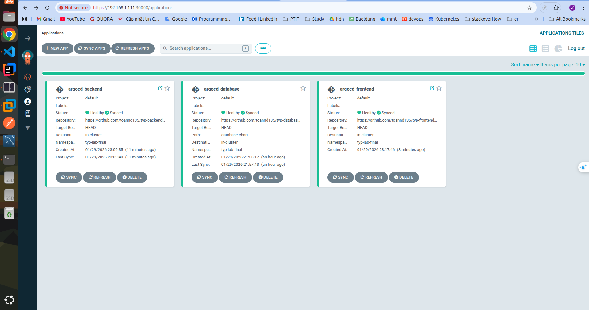

---

#### Backend Application

#### Chi tiết Backend Application
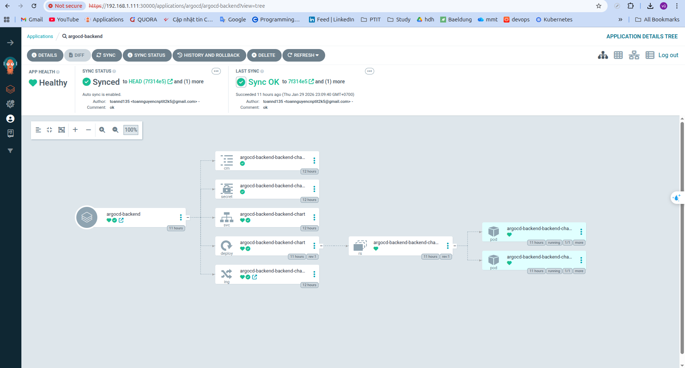

#### Service Backend


#### Deployment Backend
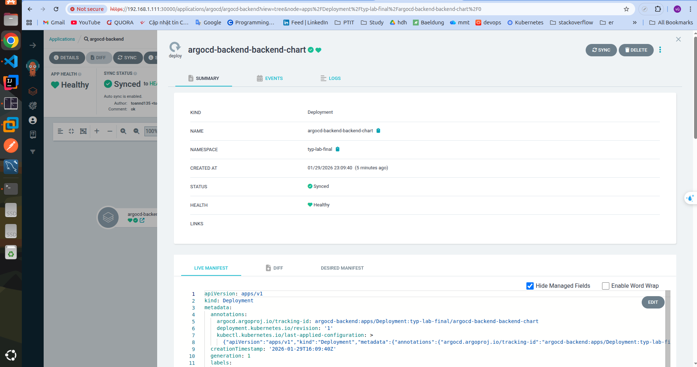


---

#### Frontend Application

#### Chi tiết Frontend Application
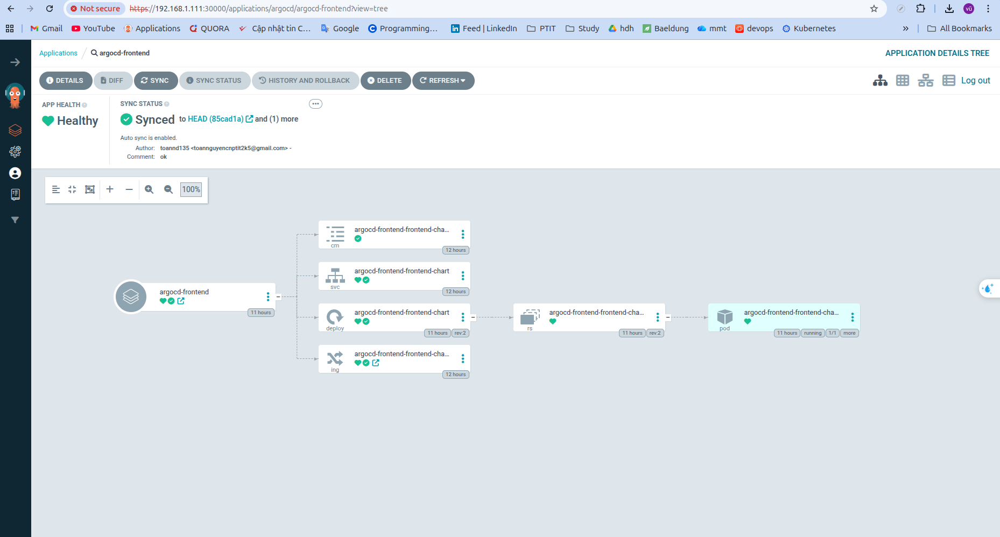


#### Service Frontend
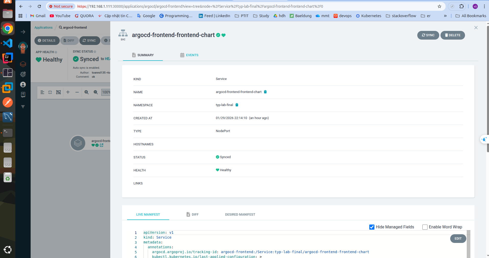

#### Deployment Frontend
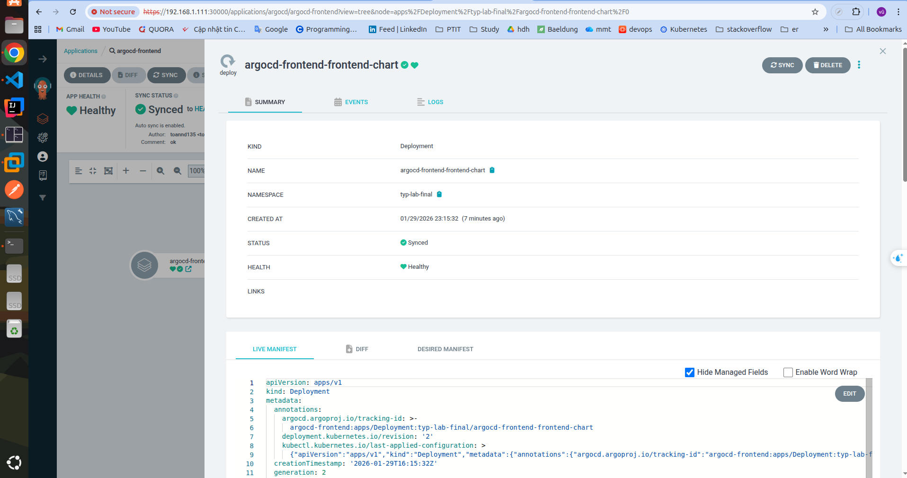

---

#### Database Application

#### Chi tiết Database
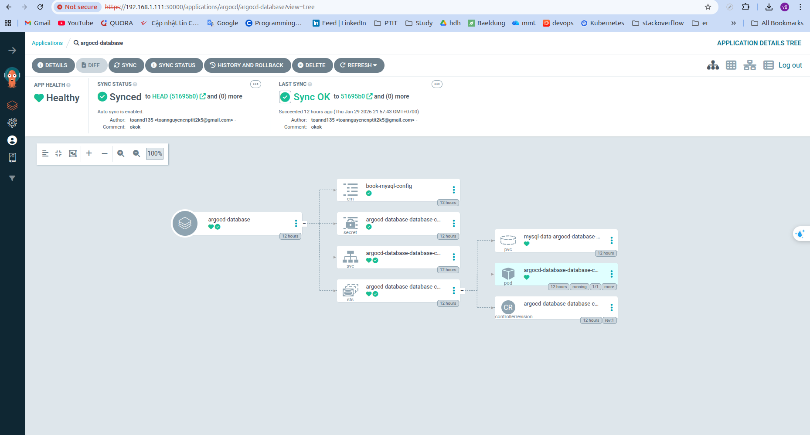

#### Service Database
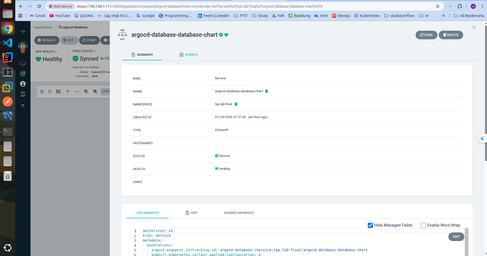

#### StatefulSet Database
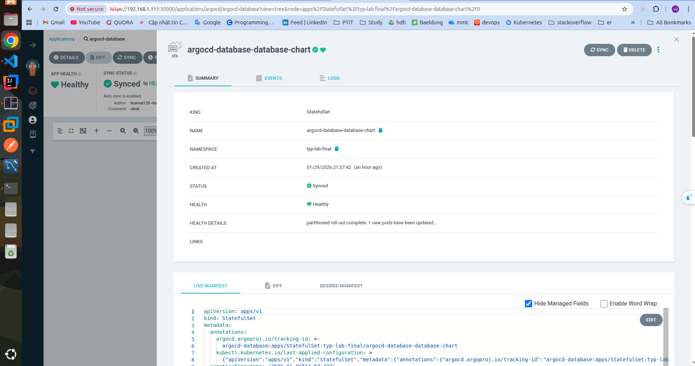


---

### Ảnh chụp màn hình trình duyệt khi truy cập vào WEB URL, API URL

#### Truy cập Frontend Application
Hình ảnh khi truy cập vào frontend:

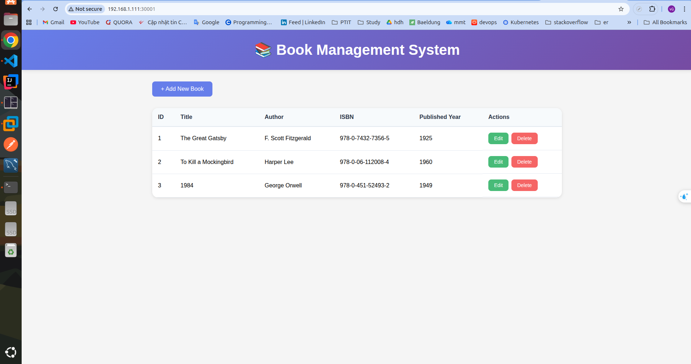
.png)
.png)
#### Truy cập API Application
Hình ảnh khi truy cập vào API:

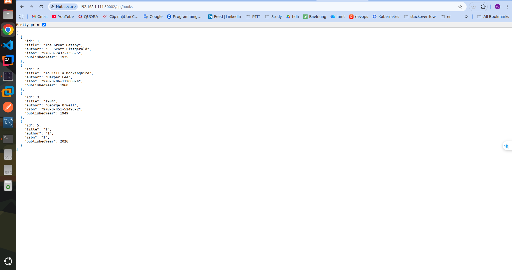

Kết quả:
- **ArgoCD và Jenkins** được cài đặt và expose thành công qua NodePort
- **Helm Charts** được thiết kế cho từng service với cấu trúc module hóa
- **GitOps workflow** với repo source code và config repository tách biệt
- **Multi-source ArgoCD Applications** quản lý deployment tự động


